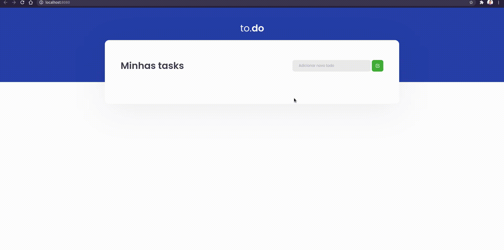

<div align="center" id="top"> 
  

  &#xa0;

  <!-- <a href="https://ibook.netlify.app">Demo</a> -->
</div>
</div>

<h1 align="center">To-do list App</h1>

<p align="center">
  <!--  -->

  <!--  -->

  <!--  -->
</p>

<!-- Status -->

<!-- <h4 align="center"> 
	🚧  Create Products 🚀 Under construction...  🚧
</h4> 

<hr> -->

<p align="center">
  <a href="#dart-about">About</a> &#xa0; | &#xa0; 
  <a href="#sparkles-features">Features</a> &#xa0; | &#xa0;
  <a href="#rocket-technologies">Technologies</a> &#xa0; | &#xa0;
  <a href="#white_check_mark-requirements">Requirements</a> &#xa0; | &#xa0;
  <a href="#checkered_flag-starting">Starting</a> &#xa0; | &#xa0;
  <a href="#memo-license">License</a> &#xa0; | &#xa0;
  <a href="https://github.com/{{YOUR_GITHUB_USERNAME}}" target="_blank">Author</a>
</p>

<br>

## :dart: About ##

to-do list app

## :sparkles: Features ##

:heavy_check_mark: Create task\
:heavy_check_mark: Check task\
:heavy_check_mark: Remove task

## :rocket: Technologies ##

The following tools were used in this project:

- [ReactJs](https://reactjs.org)
- [TypeScript](https://www.typescriptlang.org/)
- [yarn](https://yarnpkg.com/)

## :white_check_mark: Requirements ##

Before starting :checkered_flag:, you need to have [Git](https://git-scm.com), [yarn](https://yarnpkg.com/) installed.

## :checkered_flag: Starting ##

```bash
# Clone this project
$ git clone https://github.com/gabrieljcf/desafio01-trilha-react

# Access
$ cd desafio01-trilha-react

# Install dependencies
$ yarn

# Run the project
$ yarn dev

# The server will initialize in the <http://localhost:8080>
```

## :memo: License ##

This project is under license from MIT. For more details, see the [LICENSE](LICENSE.md) file.


Made with :heart: by <a href="https://github.com/gabrieljcf" target="_blank">gabrieljcf</a>

&#xa0;

<a href="#top">Back to top</a>
